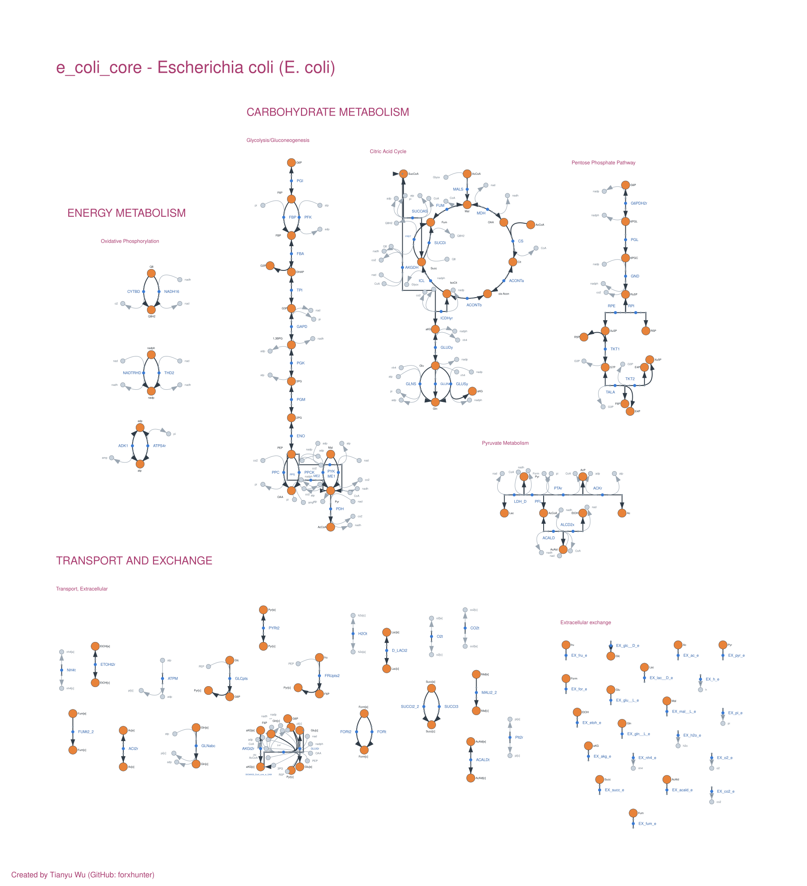

# MetaCarto

**Constructive layout synthesis for genome-scale metabolic networks**

> **This is MetaCarto 2** — branch `v2`, release `v2.0.0`. MetaCarto 1 stays on `main`, and the
> maps it drew stay published beside the new ones.

MetaCarto reads a genome-scale metabolic model and draws it the way a curator would — linear
pathway backbones, cycles as rings, cofactors as side branches — rather than the way a
force-directed algorithm does. Any model COBRApy loads will do: BiGG, Human-GEM, Yeast-GEM,
ModelSEED, as SBML, JSON, YAML or MATLAB. Output is [Escher](https://escher.github.io) JSON,
loadable in any Escher viewer, with an SVG of every map.

The layout is **constructive and deterministic**: no annealing, no random seed, no user
intervention. The same model always produces the same map.

## The generated collection

All 108 models in the [BiGG database](http://bigg.ucsd.edu/) are published under CC BY 4.0 — as
Escher JSON and as SVG — at
[forxhunter/Awesome_visualization_Metabolic_Network](https://github.com/forxhunter/Awesome_visualization_Metabolic_Network),
in two generations side by side:

| | v1 (top level) | v2 (`v2/`) |
|---|---|---|
| pathway maps | 2,621 | 2,764 |
| reactions drawn | 240,398 of 251,424 (95.6%) | 251,140 of 251,424 (99.9%) |
| whole-model canvas | none | one per model |
| text on a node, an edge or other text | not guaranteed | none in any map |

Browse them in the viewer at **[forxhunter.github.io/escher](https://forxhunter.github.io/escher/)**
via *Map ▸ Load map from library…*, which reads the collection directly; v2 opens by default and
a switch at the top of the library goes back to v1.

### A whole model on one canvas

Every model in v2 also comes as a single canvas: each pathway keeps the drawing it has on its own
map, and the pathways are packed by the shape their ink covers — related pathways together, each
KEGG superclass one captioned region. Nothing overlaps, and no text sits on a node, an edge or
other text. Both canvases below are the published SVGs; open one and zoom in.

**e_coli_core** — 95 reactions. Carbohydrate metabolism (glycolysis, the TCA
cycle with glutamate metabolism off 2-oxoglutarate, the pentose phosphate pathway, pyruvate
metabolism), oxidative phosphorylation as energy metabolism, and transport and exchange.

[](docs/figures/v2_e_coli_core_Canvas.svg)

**Recon3D** — 10,592 of the human reconstruction's 10,600 reactions on one page
(19 MB; it takes a few seconds to appear).

[](docs/figures/v2_Recon3D_Canvas.svg)

## How it works

Six ideas carry most of the quality. `layout_algorithm.md` is the design document.

1. **Primary-compound reduction** (`src/layout/compound.py`). A reaction such as
   `pyruvate + CoA + NAD⁺ → acetyl-CoA + CO₂ + NADH` contributes *one* directed edge, between
   the substrate/product pair sharing the most molecular skeleton — here pyruvate → acetyl-CoA.
   Every other participant becomes a side branch. Without this, each reaction node has degree
   4–8 and no clean orthogonal drawing exists, which is why naive layouts come out as
   hairballs. Cofactor-ness is applied as a **tier**, not a score penalty: a curated or
   high-degree cofactor is never chosen while a non-cofactor alternative exists on its side.
   That is what stops CoA → acetyl-CoA (21 shared carbons) beating pyruvate → acetyl-CoA.

2. **Direction from flux** (`src/layout/direction.py`). Reconstructions store reversible
   reactions in whichever direction the curator wrote them, so glycolysis is often recorded
   partly backwards. Parsimonious FBA decides the drawn direction wherever a reaction carries
   flux; antiparallel pairs are collapsed onto one axis.

3. **Cycles drawn as cycles** (`src/layout/motifs.py`). Rings are detected on the whole-model
   graph, contracted for layering, then expanded onto a circle rotated so the entry arc faces
   the pathway feeding it.

4. **Layered placement** (`src/layout/sugiyama.py`). Greedy feedback-arc-set, layer assignment,
   cluster-constrained crossing reduction, then **Brandes–Köpf** coordinate assignment. The
   last step is what produces straight vertical backbones; a barycentre assignment does not.

5. **Two scales** (`src/layout/compose.py`). The whole-model map runs the same layered pass one
   level up: each cluster drawing becomes a tile, tiles are ordered by metabolic flow and
   packed into a captioned poster.

6. **One canvas per species** (`src/layout/canvas.py`, `--canvas`). The dense alternative to
   the tiled poster. Each pathway is packed by the shape its ink actually covers, not its
   bounding box: central-carbon metabolism at the centre, every other KEGG superclass grown
   around it as one free-form region, and transport and exchange laid piece by piece around
   the outside as a membrane that fills the page to its corners. Pathways cannot overlap: the
   packing tests collision on a grid with clearance.

**Decomposition** (`src/layout/decompose.py`) assigns reactions to maps from the model's own
`subsystem` annotation where it has one, then from a KEGG pathway lookup, and only failing both
from network structure — `networkx` greedy-modularity communities on the currency-stripped
graph. Fetch models as JSON (`scripts/fetch_bigg.py` does by default): BiGG's SBML export drops
the subsystem annotation, and from SBML almost every model looks unannotated. Maps are then
named after the metabolic function they cover, following KEGG BRITE top-level categories, and
a map split across pages is titled by the pathways on each page.

**Nothing drawn on anything else.** Text never touches a node, an edge — curves included — or
other text; a label that does not fit beside what it names is moved further out, never hidden
and never overlapped. Reactions joining the same two metabolites get lanes of their own, so
opposed or parallel reactions read as separate lines; reactions that share a metabolite may run
together for a stretch, but only where they visibly part; straight runs of unrelated reactions
are nudged onto tracks of their own, and a reaction arrow that lands on another reaction's node
is slid along its own axis.

**Filling the page.** The species canvas is packed several deterministic ways for small and
mid-size models — page shape, arrangements per pathway, a frame sized from the total ink so the
corners get used — and the tightest packing wins only if regions stay as cohesive and linked
pathways as close as in the default.

## Any model, not only BiGG

The pipeline used to read a metabolite's compound and currency status off its BiGG id (`atp_c`).
Human-GEM spells ATP `MAM01371c`, Yeast-GEM numbers metabolites per compartment (`s_0434`), and
ModelSEED writes `cpd00002_c0`, so on those models no cofactor was recognised. `identity.py`
now answers both questions from the model itself — KEGG and ModelSEED cross-references, the
compartment field, names, and, failing all of those, formula and charge — and checks
annotations against formulas (BiGG annotates superoxide with oxygen's KEGG id). Reactions whose
compounds have no formula pick their main pair by name instead of being dropped. Exchange,
demand and biomass steps are recognised by SBO term and objective as well as by BiGG prefix.

```bash
python layout_v2.py --model path/to/yeast-GEM.xml --group-function --canvas
python diy_map.py --model path/to/Human-GEM.xml --pathway "Glycolysis*"
```

Both run end to end on the current Yeast-GEM and Human-GEM releases: ATP, NAD(H), CoA and water
are recognised as currency, and every map passes the text-overlap gate. (YAML means COBRApy's
YAML; Human-GEM's own `.yml` is a different format — use its SBML.)

A test respells e_coli_core's ids the Human-GEM and Yeast-GEM ways and requires every
reaction's drawn pair to stay the same.

## Draw your own map

`diy_map.py` draws any selection with the same engine and holds it to the same rules:

```bash
python diy_map.py --model e_coli_core --list pathways
python diy_map.py --model e_coli_core --pathway Glycolysis --pathway "Pentose*"
python diy_map.py --model iML1515 --metabolite glu__L --radius 1 --no-boundary --name "Glutamate hub"
python diy_map.py --model iML1515 --superclass "Amino acid*" --strict
python diy_map.py --model Recon3D --reaction PGI,PFK,FBA --connect 3
```

Select by pathway or subsystem (substring or glob), KEGG superclass, reaction id, everything
within *N* reactions of a metabolite (walking only through non-currency compounds), a keyword,
or a file of reaction ids; `--connect N` adds the fewest reactions that join separate pieces.
Up to 80 reactions are drawn as one connected layout, so the links between chosen pathways are
edges; more are drawn pathway by pathway on one canvas. Each run writes the map JSON, its SVG,
and a `.selection.json` recording what was asked for, then prints the published quality gates;
`--strict` exits non-zero if the map breaks one.

## Editing in the viewer

The [Escher fork](https://forxhunter.github.io/escher/) that serves the collection is built for
maps that were drawn automatically and then adjusted by hand:

- **Drag a reaction as a whole.** Grabbing a reaction's arrow or its label moves its markers,
  the cofactors only it uses and its label together; metabolites it shares with other reactions
  stay where they are. Hold **Alt** to move a single node or label.
- **Double-click to select** a whole reaction, or a pathway or region by its caption on a
  species canvas — then drag, nudge or delete it as one. The map records which pathway each
  reaction belongs to, which is what makes this possible.
- **Labels follow and stay clear.** A moved label keeps its offset; one that lands on a node or
  another label moves to the nearest clear spot around its node.
- **Short labels** (`Mal` rather than `mal__L_c`, a name rather than `MAM01371c`) are shown by
  default; *Settings* switches back to ids or full names.
- Arrow keys nudge the selection (Shift for ten times as far); 100 undo steps.
- Hand-edited maps save with everything the pipeline wrote — short labels, label sizes, pathway
  membership — so a map can go back and forth between the pipeline and the editor.

## Install and run

The map collection and the Escher fork that serves it are **submodules**, so the parent
repository records which commit of each this work was built against:

```bash
git clone --recurse-submodules https://github.com/forxhunter/MetaCarto.git
# already cloned without them:
git submodule update --init
```

The working interpreter is a conda environment with `cobra`, `networkx` and `numpy`:

```bash
python layout_v2.py --model e_coli_core --preview
python layout_v2.py --model Recon3D --group-function --max-cluster 120
python layout_v2.py --model iML1515 --canvas-only --preview   # the whole model on one canvas

# The published v2 collection, in one command. `--max-cluster 120` is part of
# it: without it the same models give roughly a third as many, larger maps.
python layout_v2.py --all --group-function --max-cluster 120 --canvas --out data/v2_maps

# Publish beside v1, never over it, and index each generation on its own.
python scripts/prepare_repo.py --source data/v2_maps --repo escher_maps_BiGG/v2
python scripts/build_map_index.py --root escher_maps_BiGG/v2
```

Useful flags: `--group-function` merges pathway clusters into functional maps, `--subsystem`
draws one named cluster, `--combined` adds a whole-model map, `--canvas` adds the dense
single-canvas one (`--canvas-only` writes nothing else), `--no-fba` skips pFBA
orientation, `--preview` writes PNG, SVG and vector PDF alongside the JSON.

`data/` is not tracked. Populate it with `scripts/fetch_bigg.py` and `scripts/fetch_kegg.py`.

## Quality gates

`src/layout/metrics.py` scores every emitted map — edge orthogonality, crossings per edge,
longest straight run, node separation, three kinds of label collision, local density
(`hairball_index`), occupancy and aspect ratio. Targets and their definitions are in
`layout_algorithm.md` §9.

```bash
python scripts/iterate.py --model e_coli_core   # exits non-zero if any gate fails
```

`iterate.py` adds three gates `metrics.py` does not have: print legibility (label size in
points once the map is fitted to a journal column), title/caption collisions, and canvas
overflow.

Two corpus-wide checks run without writing the collection:

```bash
python scripts/name_census.py --jobs 16     # what every map would be called; Other share
python scripts/canvas_census.py --jobs 16   # every model on one canvas vs --combined
```

`canvas_census.py` reports, per model, blank area and the largest empty square and rectangle
(`metrics.blank_space`), cells where two pathways' ink meet (`canvas.cross_overlaps`, which
must be zero), and whether a superclass stays together and linked pathways sit near each
other (`canvas.organisation`). `metrics.reaction_overlaps` counts nodes on nodes, edges through
nodes and edges along edges, each split into overlaps between reactions that share a metabolite
and between reactions that do not.

The v2 collection, all 108 models:

| | v2, all 108 models |
|---|---|
| reactions drawn | 251,140 of 251,424 (99.9%), none twice |
| pathway maps / whole-model canvases | 2,764 / 108 |
| text on a node, an edge or other text | 0, in every map and canvas |
| pathways overlapping on a canvas (`cross_overlaps`) | 0 |
| segments axis-aligned, median map | 0.985; 2,745 of 2,764 maps at 0.90 or above |
| crossings per edge, median map | 0.070 (90th percentile 0.40) |
| `hairball_index`, median map | 2.99 (target 3.0) |
| canvas blank share, median (worst) | 0.228 (0.377) |
| largest empty rectangle, median (worst) canvas | 2.1% (4.9%) of the canvas |
| region cohesion on a canvas, median (worst) | 0.68 (0.51) |
| edges through an unrelated metabolite | 37 per 1,000 reactions |
| nodes of unrelated reactions overlapping | 19 per 1,000 reactions |

The last two are what is left to do: reactions that share nothing should never touch, and
nearly four reactions in a hundred still run through a metabolite they have nothing to do with,
mostly a long route passing a stub on the way. Text overlaps are zero by construction.

## Known limitations

- 284 of 251,424 BiGG reactions have no drawable primary pair and are omitted.
- Large merged pages (around 120 reactions, several compartments) still cross themselves:
  the median page has 0.07 crossings per edge, the median page of 100 or more
  reactions 0.10, and one page in ten more than 0.4.
- Whole-model maps (`--combined`, `--canvas`) are not print figures. Putting 10,600 reactions
  on one page leaves each so little area that labels land well under a point, however densely
  the page is packed. They are for zooming in the SVG or in Escher; the per-cluster maps are
  the printable artifact.
- `hairball_index` still exceeds its target on most large merged function maps.
- H⁺ and H₂O are suppressed from every map.
- Compartments are not drawn as envelopes: the Escher schema has no region primitive.

## Legacy v1 pipeline

`process_subsystems.py` and `src/refinement.py` are the original simulated-annealing pipeline.
They are kept for comparison and are **not** the production path. Their Escher output is
schema-invalid — `node_type` is set to `"reaction"`, which is not a legal value; every segment
has null `b1`/`b2` so edges draw as straight diagonals; stoichiometric coefficients are
hardcoded to 1, discarding direction. `run_pipeline.py` lays out a hardcoded 7-node mock graph
and is a demo, not a driver.

`plan.md` describes a GNN + reinforcement-learning architecture that was explored and
abandoned. None of it is on either production path; see `experiments/README.md`.

## Licence and citation

**[CC BY 4.0](https://creativecommons.org/licenses/by/4.0/)**, the same licence as the map
collection. You may use, modify and redistribute this for any purpose including commercially,
**on the condition that you give attribution** — attribution is a term of the licence, not a
courtesy.

If you use MetaCarto, or maps it generated, in a paper, figure, talk, poster, database or
derived software, please cite this repository. `CITATION.cff` carries the machine-readable
form and GitHub renders it as *Cite this repository*.

```bibtex
@software{Wu_MetaCarto_constructive_layout,
  author  = {Wu, Tianyu},
  license = {CC-BY-4.0},
  title   = {{MetaCarto: constructive layout synthesis for genome-scale metabolic networks}},
  url     = {https://github.com/forxhunter/MetaCarto}
}
```

Please also cite the underlying model from [BiGG Models](http://bigg.ucsd.edu/) and, where the
maps are displayed, [Escher](https://doi.org/10.1371/journal.pcbi.1004321).

A note for anyone reusing the code: CC BY is a content licence rather than a software licence,
so it carries no patent grant and is not OSI-approved. It is used here deliberately, to keep
the citation requirement identical across the software and the maps.

## Credits

**Created by Tianyu Wu (GitHub: [forxhunter](https://github.com/forxhunter))**, University of
Illinois Urbana-Champaign.
